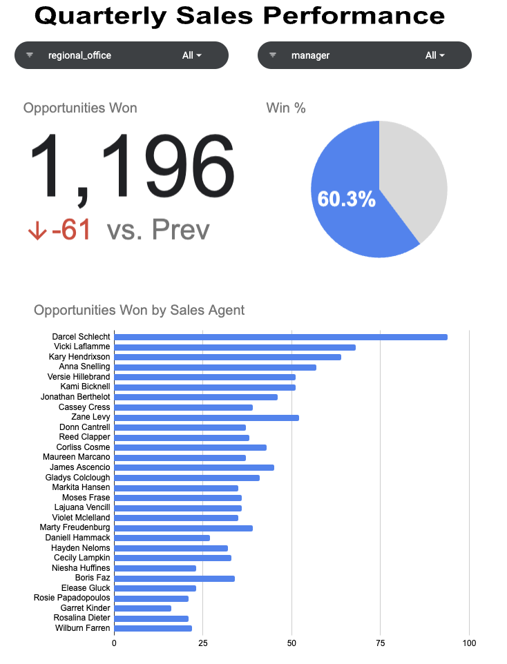

# CRM Sales Dashboard

A comprehensive and interactive dashboard designed to visualize key sales and customer relationship management (CRM) metrics. This project empowers business teams to track sales performance, monitor KPIs, and gain insights into customer behavior through clean and dynamic visuals.

# 🧰 Built With

Google Sheets

# 📈 Features
Visualize quarterly sales trends

Monitor key performance indicators (KPIs) like:

Opportunites Won

Win %

Opportunies Won by Sales Agent

Filter by region and manager

# 📊 Example Visuals

# View On Google Sheets

https://docs.google.com/spreadsheets/d/1y_DKCbyQXdMfwnDnDyy70AZmdvyRHbGB23cVznxLwvM/edit?usp=sharing
